# 🔧 FIX: Upload Error on Railway (401 Unauthorized)

## ✅ **DIAGNOSIS COMPLETE**

The upload is **actually working** - files are reaching the server successfully. However, Livewire's signed URL validation is failing, causing the upload to be marked as errored.

### Root Cause

Livewire uses **signed URLs** to process uploaded files. These signatures require a consistent `APP_KEY`:

1. Livewire generates a signed URL using APP_KEY (during upload initialization)
2. File uploads successfully
3. Livewire tries to validate the signed URL using APP_KEY (during finalization)
4. **If APP_KEY changed between steps 1 and 3, validation fails → 401 error**

On Railway, your startup script generates a new `APP_KEY` on each deployment/restart, which breaks the signature validation.

---

## 🚀 **THE FIX** (Choose ONE option)

### Option 1: Use the Key Generated Locally (RECOMMENDED)

A fresh key has been generated for you:

```
APP_KEY=base64:jEoTuqzl8HxehIvga0Nw2gxf02P5/WlWldDRR9/Dfqs=
```

**Steps:**

1. Go to Railway Dashboard → Your Project
2. Click on "Variables" tab
3. Click "New Variable"
4. Enter:
    - **Name:** `APP_KEY`
    - **Value:** `base64:jEoTuqzl8HxehIvga0Nw2gxf02P5/WlWldDRR9/Dfqs=`
5. Click "Add" or "Save"
6. Railway will auto-redeploy with the new variable

---

### Option 2: Use the Key from Railway Logs

1. Go to Railway Dashboard → Your Project → Deployments
2. Click on the latest deployment
3. View the deployment logs
4. Look for this section:

```
==========================================
⚠️  CRITICAL: APP_KEY is NOT SET!
==========================================

🔑 GENERATED APP_KEY:
base64:xxxxxxxxxxxxxxxxxxxxxxxxxxxxx

==========================================
```

5. Copy the **entire key** (starting with `base64:`)
6. Go to Variables tab and add it as `APP_KEY`

---

## 🧪 **VERIFY THE FIX**

After Railway redeploys with the APP_KEY set:

1. Go to your Railway app: https://thegoodbeaconnewsoutlet-production.up.railway.app/admin
2. Navigate to Articles → Edit any article
3. Try uploading a featured image
4. **Expected result:** Upload should complete successfully with no 401 error

---

## 📋 **Technical Details**

### What Was Happening:

```mermaid
sequenceDiagram
    Browser->>Livewire: Start file upload
    Livewire->>Livewire: Generate signed URL with APP_KEY_1
    Browser->>Server: Upload file chunks
    Server-->>Browser: Upload successful
    Browser->>Livewire: Finalize upload
    Livewire->>Server: Validate signed URL with APP_KEY_2
    Server-->>Livewire: ❌ Signature invalid (keys don't match)
    Livewire-->>Browser: ❌ 401 Unauthorized
```



### What Will Happen After Fix:

```mermaid
sequenceDiagram
    Browser->>Livewire: Start file upload
    Livewire->>Livewire: Generate signed URL with APP_KEY
    Browser->>Server: Upload file chunks
    Server-->>Browser: Upload successful
    Browser->>Livewire: Finalize upload
    Livewire->>Server: Validate signed URL with APP_KEY
    Server-->>Livewire: ✅ Signature valid
    Livewire-->>Browser: ✅ Upload complete
```



---

## 🔍 **How We Found This**

1. Examined Livewire request payload - upload was succeeding
2. Examined response - `_uploadErrored` was being called
3. Traced to `FileUploadController.php:29`:
    ```php
    abort_unless(request()->hasValidSignature(), 401);
    ```
4. Identified that signed URLs require consistent APP_KEY
5. Confirmed Railway was generating new keys on each deploy

---

## 📝 **Additional Notes**

-   **Security:** The APP_KEY is essential for Laravel's encryption and should be kept secret
-   **Persistence:** Setting it in Railway variables ensures it persists across deployments
-   **Local Development:** Your local `.env` file already has an APP_KEY set
-   **Database:** No database changes needed for this fix
-   **Code:** No code changes needed - this is purely configuration

---

## ❓ **Troubleshooting**

### If uploads still fail after setting APP_KEY:

1. **Verify the variable is set:**

    - Go to Railway → Variables
    - Confirm `APP_KEY` is listed
    - Value should start with `base64:`

2. **Check deployment logs:**

    - Should now see: `✅ APP_KEY is set`
    - Should NOT see: `⚠️ CRITICAL: APP_KEY is NOT SET!`

3. **Clear your browser cache:**

    - Hard refresh: Cmd+Shift+R (Mac) or Ctrl+Shift+R (Windows)
    - Try in incognito/private mode

4. **Check file size:**
    - Current limit: 5MB for featured images
    - If you need larger files, increase in `config/livewire.php`

---

## ✅ **Success Indicators**

You'll know it's fixed when:

-   ✅ No 401 errors in browser console
-   ✅ No "failed to upload" validation errors
-   ✅ Image appears in the file upload preview
-   ✅ Image is saved when you click "Save changes"
-   ✅ Image displays on the article in the frontend

---

**Created:** 2025-12-01  
**Status:** Ready to implement  
**Estimated Time:** 2-3 minutes
